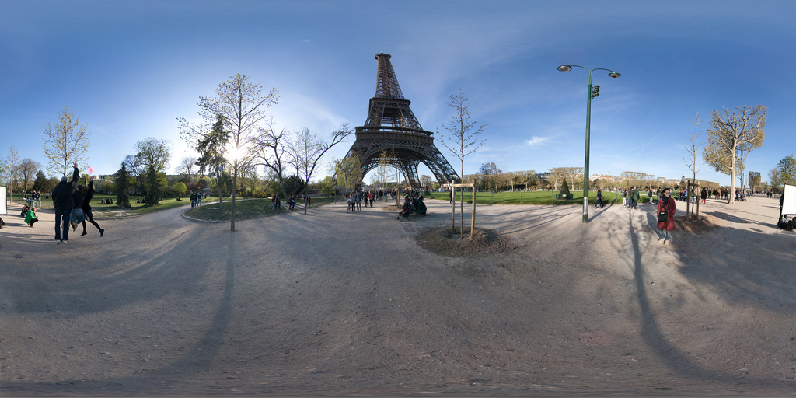
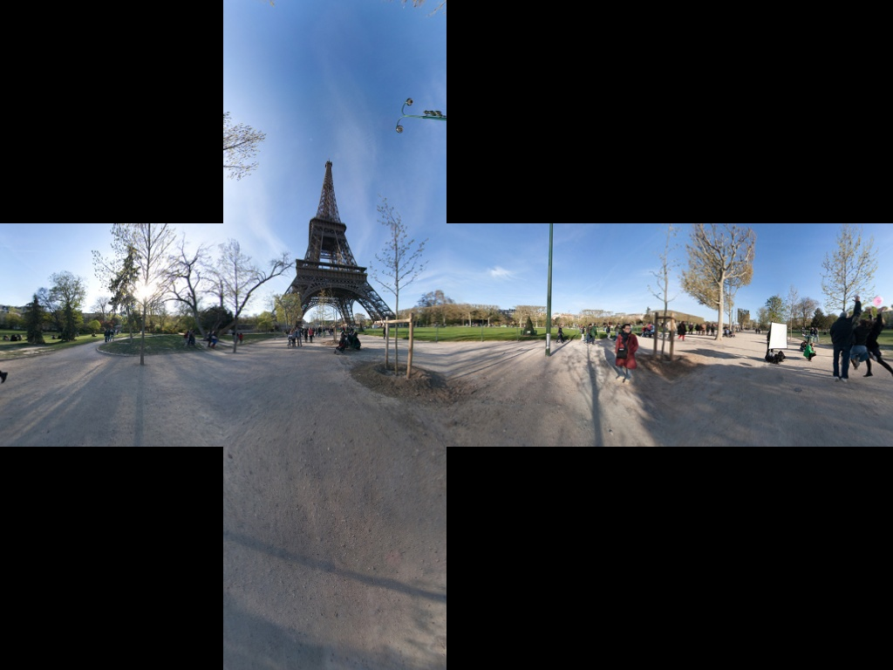
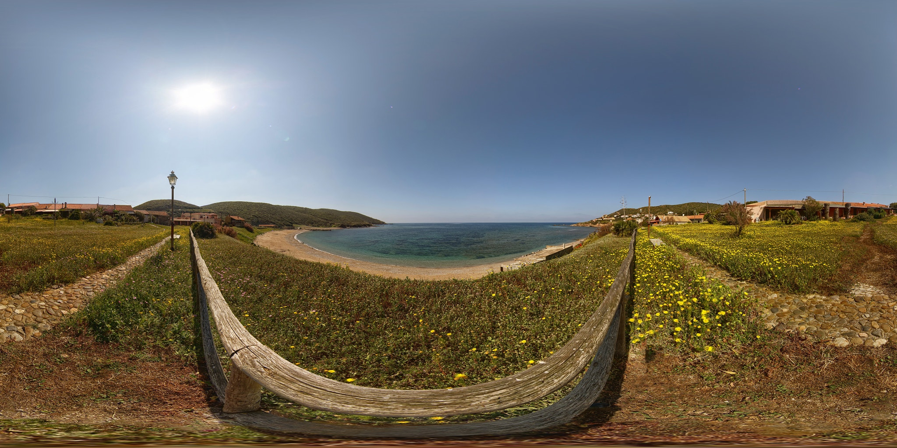
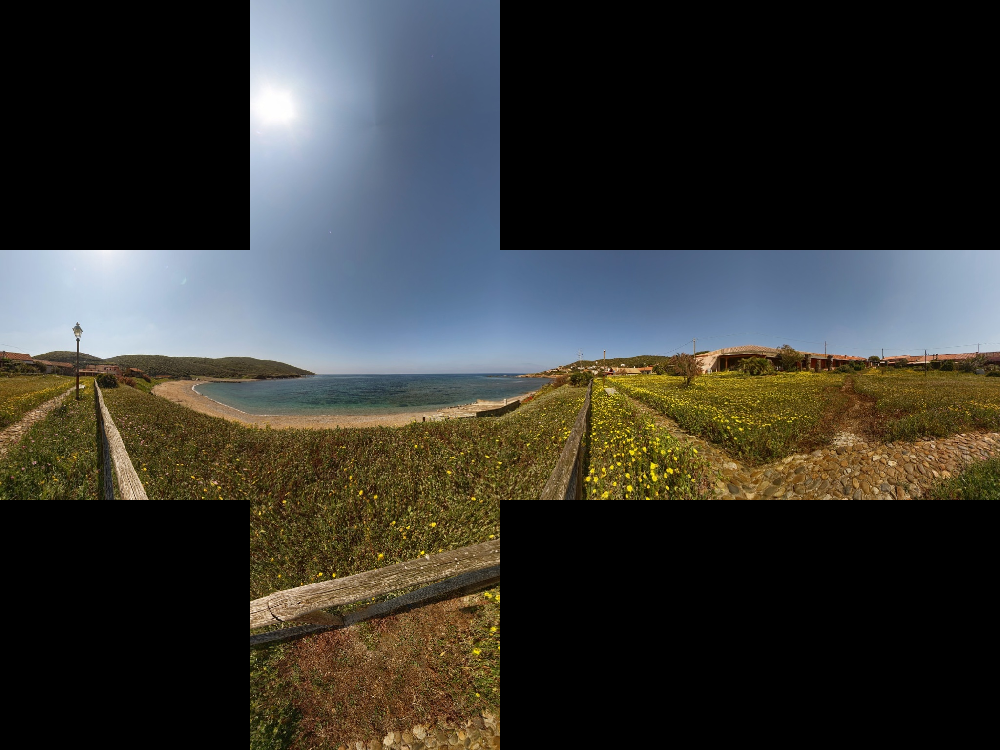
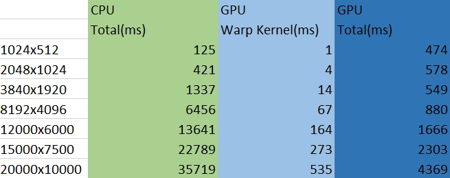
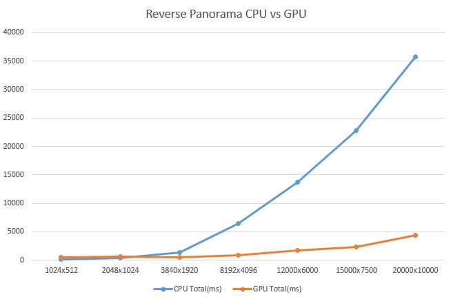
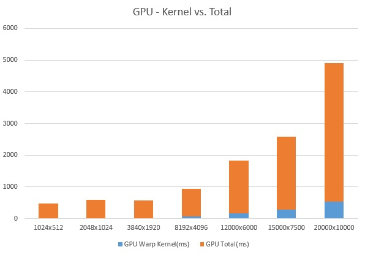
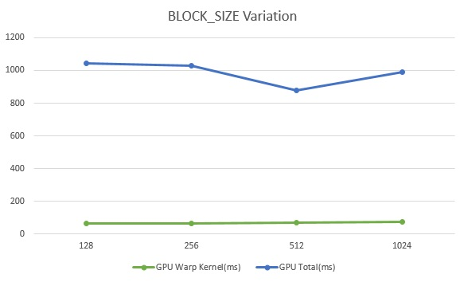
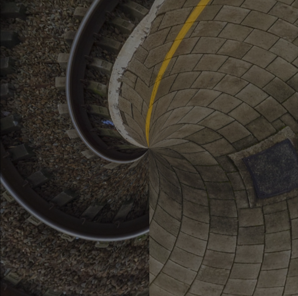
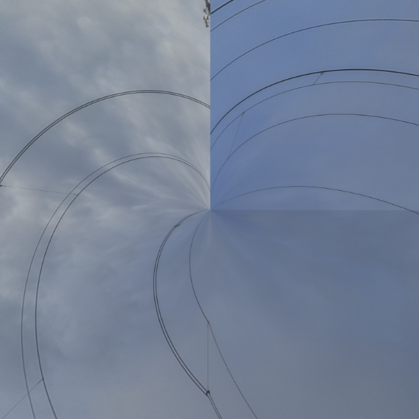

GPU Computed Reverse Panorama
=============================

**University of Pennsylvania, CIS 565: GPU Programming and Architecture, Project 6**

* Yash Vardhan
* Tested on: Windows 10 Pro, Intel i5-4200U (4) @ 2.600GHz 4GB, NVIDIA GeForce 840M 2048MB

In this project, I have implemented an inverse transformation to convert an equirectangular panorama into its constituent images through the use of GPU and CPU and performed an analysis between them.

*Note* - The valid equirectangular/spherical/cylindrical panorama resolution is 2:1 and this project follows it strictly.

###Process of Inverse Transformation###
* Distribute the input panorama image into 6 segments: Top, Bottom, Left, Right, Front and Back.
* For each pixel use bilinear interpolation between the four surrounding pixels.
* Calculate coordinates of bottom-left and top-right pixels, and the fraction of way across pixel in one image segment.
* Calculate pixel values at 4 corners of the image segment.
* Interpolate he pixel values across 3 colour channels.
* Draw the pixel values in the out image for that image segment.

# Features:
* Reversing a cylindrical panorama to images
* Toggleable Timer for Performance Analysis

# Results:

|  Input Panorama | Output |
| ----------- | ----------- |
|  |  |
|  |  |
|  |  |
|  |  |

# Performance Analysis:

The Panorama Resolution Size was varied rom 1024x512 to 20000x10000 and performance was recorded:

The time taken by pixel warp kernel and the total time taken by gpu was analyzed:

There is a big proportion of unvoidable memory access in the case of GPU, which bottlenecks its performance.

Block Size was varied from 128 threads per block to 1024:

###Bloopers:###
A little too much of warping. :P
| ----------- | ----------- |
|  |  |
